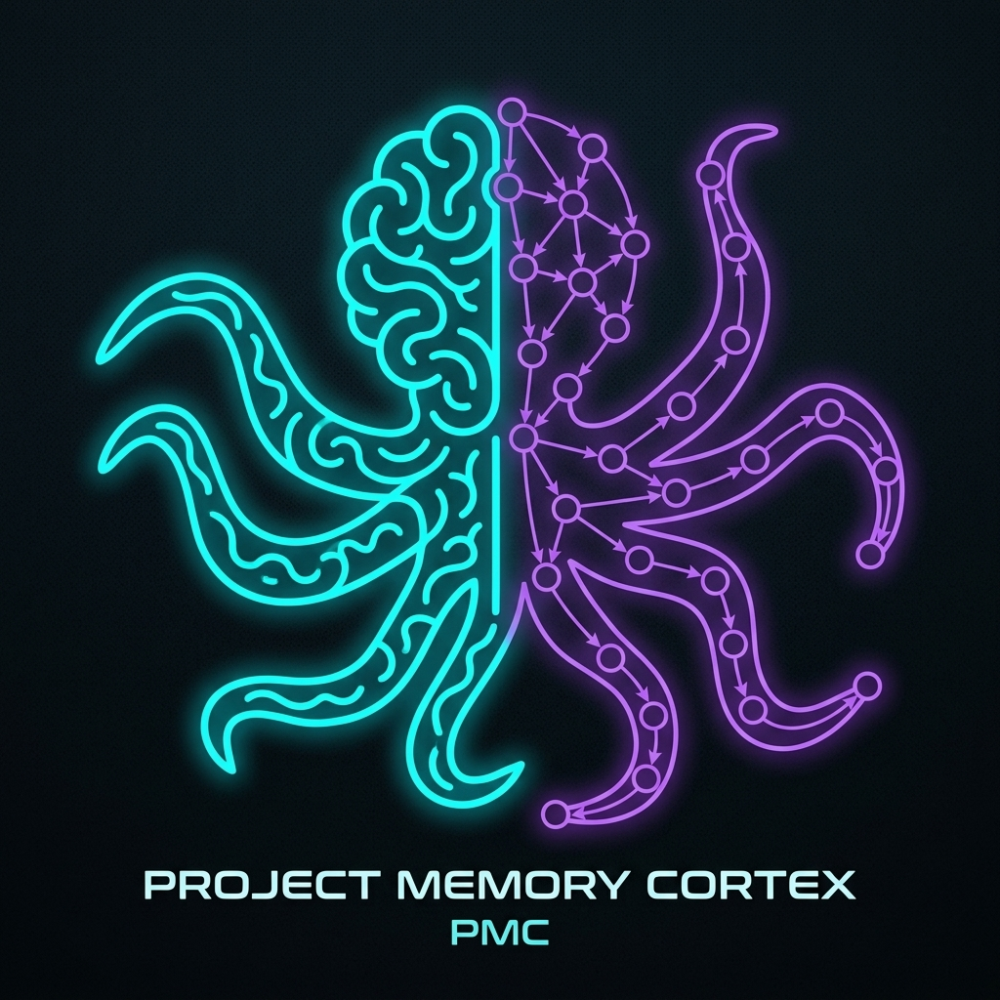

# Tacit



```text
  _______   _    _____ _____ _______ 
 |__   __| / \  / ____|_   _|__   __|
    | |   / _ \| |      | |    | |   
    | |  / ___ \ |___  _| |_   | |   
    |_| /_/   \_\____|_____|   |_|   
```

> **Persistent, immutable, timestamped institutional memory and tacit knowledge layer for AI coding agents.**  
Survives context window wipes, model switches, compaction, and chat resets.

> [!WARNING]
> **Development Preview**: Tacit is currently in active development. Features, database schemas, and CLI commands may change or break frequently. Please back up your memories before upgrading.

---

## Motivation and The Problem It Solves

### The Problem: AI Amnesia in Modern Software Engineering
Coding agents/harnesses (Claude, Cursor, Antigravity, Deepseek-Harness, Codex) possess reasoning capabilities, but suffer from **project amnesia**:
1. **Context Window Limits & Compaction Loss**: As conversations grow, context is summarized or wiped. The agent forgets why a specific architectural decision was made 20 turns ago.
2. **Session Resets & Model Switching**: Starting a new chat destroys working institutional memory.
3. **Repeated Mistakes & Bug Regressions**: Agents often re-introduce the same bugs, test the same failed hypotheses, or undo undocumented workarounds ("hacks") previously resolved by another session or teammate.
4. **Scattered Tacit Knowledge**: Critical deployment commands, environment quirks, and architectural caveats live only in chat histories rather than in an indexed, verifiable repository.

### What is Tacit?
**Tacit** is a local institutional memory layer for AI software engineers. It works like Git, but for project decisions instead of source code. It runs locally as a Model Context Protocol (MCP) server, storing memories in an SQLite database for sub-millisecond search, and syncs them to plain Markdown files in your repository.

* **Immutable Knowledge DAG**: Every decision, command, hack, and fix is stored with a SHA-256 content hash and a Merkle root calculated from its parent nodes, creating a cryptographic audit trail.
* **Fast Full-Text Retrieval**: Utilizes SQLite FTS5 for sub-millisecond keyword and BM25 searches.
* **Bootstrapping**: Agents query recent context on session startup to align with past design decisions.
* **Local Web Dashboard**: A live-reloading UI to search, audit, filter, and insert project memories directly.

> [!NOTE]
> **Why Local Ownership Matters**: You can start a completely fresh session or migrate to a brand new coding harness, and your assistant will still instantly access all engineering decisions and institutional knowledge recorded since the first day of development. While model intelligence lives in a third-party cloud, its contributions to your project's tacit knowledge stay locally owned by your team.

---

### Core Concepts: Tacit Knowledge & Causal Node DAGs

To get the most value out of Tacit, both developers and AI agents must understand what Tacit stores and how it structures knowledge:

> [!IMPORTANT]
> **What Tacit DOES NOT Store**:
> * **No Chat Histories**: Tacit does not log your conversation transcripts or raw prompt histories.
> * **No Source Code Files**: Tacit does not index your repository's raw codebase files.
> 
> **What Tacit DOES Store (Tacit Knowledge)**:
> Tacit exclusively records **Tacit / Institutional Knowledge**: the undocumented "why" behind your code. This includes architectural constraints, tricky workarounds (hacks), specific environment dependencies, critical operational commands, and resolved bug caveats.

#### The Parent-Child Node Relationship
Tacit structures knowledge as a **Directed Acyclic Graph (DAG)** of **Memory Nodes**:
* **Parent Nodes (Foundations)**: Past decisions, patterns, or limitations that set the initial context (e.g., *"Migrated to an async backend request pipeline"*).
* **Child Nodes (Derived Decisions)**: Subsequent decisions, hotfixes, or workarounds triggered because of a parent context (e.g., *"Resolved connection pool exhaustion by raising limit to 30"*).

By explicitly linking parents and children, Tacit builds a mathematical causality tree. When an agent queries a decision, Tacit doesn't just retrieve the node, but walks up the tree to tell the agent the entire ancestral history.

---

### Real-World Example: Solving "AI Amnesia" in Practice

Imagine starting a **fresh, blank chat session** (zero chat history) and asking your coding harness:
> *"Why did we change the database pool size and add connection timeouts?"*

Without Tacit, the agent is blind. You would have to manually explain to it what it knew in the previous session. With Tacit, the agent automatically executes the following tools under the hood to resolve the answer in seconds:

#### 1. Bootstrapping Context
At the start of the session, the agent calls `memory_context(timeframe="week")` to load recent workspace decisions into its system context:
```json
{
  "Decisions": [
    { "id": "9385134c", "title": "Decision: Resolved database connection pool exhaustion under load" },
    { "id": "54bd72c1", "title": "Decision: Enabled transaction middleware for all API writes" }
  ]
}
```

#### 2. Targeted Querying
The agent performs a quick search using `memory_search(query="database pool")` to locate the exact node:
```json
{
  "id": "9385134c-eb52-4d70-824a-a21b23033df7",
  "title": "Decision: Resolved database connection pool exhaustion under load",
  "tags": ["database", "performance", "bugfix"]
}
```

#### 3. Fetching Node & Lineage
The agent queries the full memory node via `memory_get(node_id="9385134c-eb52-4d70-824a-a21b23033df7")`, retrieving the complete content and its dynamic Merkle DAG lineage:
```text
==================================================
MEMORY NODE: 9385134c-eb52-4d70-824a-a21b23033df7
Type: DECISION | Impact: MEDIUM | Status: active
Recorded: 2026-08-21 21:14:11 E. Africa Standard Time by ai-agent
Title: Decision: Resolved database connection pool exhaustion under load
==================================================

CONTENT:
Resolved database connection pool exhaustion by increasing max pool size
from 5 to 30, implementing a 5000ms query timeout, and wrapping active
transactions in try/finally blocks to guarantee connection release.
This prevents HTTP workers from hanging when concurrent database queries
spike during high traffic.

TAXONOMY & LINEAGE:
Tags: database, performance, bugfix
Scope: /src/db/connection.js, /src/middleware/transaction.js
Parents: 54bd72c1-3a34-4895-b233-0d7dde557eb4

DECISION TREE / CAUSALITY:
CAUSAL ANCESTORS (Foundations):
  └── [decision] Decision: Migrated backend to async request handling (`a6a9dc1e`)
  └── [decision] Decision: Implemented multi-tenant connection mapping (`da20d017`)
  └── [decision] Decision: Configured read-replicas for analytics queries (`5e839b22`)
  └── [decision] Decision: Enabled transaction middleware for all API writes (`54bd72c1`)
==================================================
```

#### 4. The Agent's Answer
Equipped with this structural and historical background, the agent immediately constructs a correct answer with no search latency or hallucination:
> We increased the database connection pool size from 5 to 30 and implemented query timeouts to resolve connection pool exhaustion under high concurrency load.
> 
> **Why it was necessary:**
> * **Async Request Load**: Migrating the backend to async request handling (`a6a9dc1e`) allowed for high concurrency, quickly saturating the original 5-connection pool limit.
> * **Connection Leak**: The transaction middleware (`54bd72c1`) did not guarantee connection release when write queries failed, leaking active database connections.
> * **The Solution**: Raising the pool limit to 30 accommodates peak concurrency, adding a 5000ms timeout prevents queries from hanging indefinitely, and wrapping transactions in try/finally blocks guarantees that connections are always returned to the pool.

---

## Architecture Overview

```
 ┌──────────────────────────────────────────────────────────────────┐
 │                     AI Coding Agents & Editors                   │
 │  (Antigravity, Cursor, Claude, Deepseek-Harness, Opencode)       │
 └───────────────────────────────┬──────────────────────────────────┘
                                 │ Standard MCP Protocol (stdio / SSE)
                                 ▼
 ┌──────────────────────────────────────────────────────────────────┐
 │                   FastMCP Server Layer (FastMCP)                 │
 │   Tools: memory_add, memory_search, memory_get, memory_context   │
 └───────────────────────────────┬──────────────────────────────────┘
                                 │
        ┌────────────────────────┼────────────────────────┐
        ▼                        ▼                        ▼
 ┌───────────────┐        ┌───────────────┐        ┌───────────────┐
 │ SQLite + FTS5 │        │  Merkle DAG   │        │ Markdown &    │
 │ Engine (BM25) │        │ Lineage Engine│        │ Preview Server│
 └───────┬───────┘        └───────┬───────┘        └───────┬───────┘
         │                        │                        │
         ▼                        ▼                        ▼
 ┌──────────────────────────────────────────────────────────────────┐
 │              Local Project Directory (.project-memory/)          │
 │              - memory.db (Encrypted / WAL SQLite)                │
 │              - Merkle Hash Tree & Causal Ancestry DAG            │
 └──────────────────────────────────────────────────────────────────┘
```

---

## Table of Contents
1. [Installation](#1-installation)
2. [AI Agent Integration (MCP Setup)](#2-ai-agent-integration-mcp-setup)
3. [Agent Master Prompt & Rules](#3-agent-master-prompt--rules-automated)
4. [CLI Usage & Commands](#4-cli-usage--commands)
5. [Live Markdown Preview Server](#5-live-markdown-preview-server)
6. [MCP Tools Reference](#6-mcp-tools-reference)
7. [Multi-Project Support](#7-multi-project-support)
8. [Testing](#8-testing)

---

## 1. Quick Start & Installation

To get Tacit running in your environment, execute the following commands in sequence:

### Step 1: Install Tacit from source
```bash
# Clone the repository
git clone https://github.com/AlexLeoTz/project-memory-cortext.git
git checkout main # or the current active branch

# Install globally on your machine (editable mode for active development)
pip install -e .
```

> [!IMPORTANT]
> **Windows Installation/Update Note**: Before running `pip install -e .` or `tacit update` on Windows, make sure all running Tacit instances (such as Cursor, Claude Desktop, or `tacit serve`) are stopped. Windows locks active `.exe` binaries, which will cause the installer to crash with a `PermissionError`.

---

### Step 2: Register MCP server globally
This registration command modifies your editor's settings globally. It can be run from any folder or terminal directory:
```bash
# For Antigravity CLI
tacit install-mcp --client antigravity

# For Claude Desktop
tacit install-mcp --client claude

# For Claude Code (Terminal CLI)
tacit install-mcp --client claude-code

# For Cursor
tacit install-mcp --client cursor
```

---

### Step 3: Initialize the project memory directory
Navigate to your specific project workspace directory (e.g. `cd /path/to/my-project`) and initialize the database. **This command must be run inside your project root directory**:
```bash
tacit init
```

---

### Step 4: Run the live markdown preview server
Start the web dashboard to search, view, and insert project memories directly. **This command must be run inside your project root directory**:
```bash
tacit serve
```

---

## 2. AI Agent Integration (MCP Setup)

Tacit runs as a local MCP server that automatically detects whichever project directory your coding harness has open.

---

### B. Manual MCP Configuration & Client Setup

Tacit runs locally as an **STDIO MCP server**: a local background process started and communicated with via standard input/output streams by your AI coding client.

> [!NOTE]
> **Harness Compatibility**: Tacit is thoroughly tested and verified to work natively in **Antigravity CLI**, **DeepSeek Harness**, and **Claude Code**. If you encounter issues running it in other environments, please file a bug report.

#### 1. Claude Code & Claude Desktop
Add this to your `claude_desktop_config.json` (on Windows: `%APPDATA%\Claude\claude_desktop_config.json`):

```json
{
  "mcpServers": {
    "tacit": {
      "command": "tacit",
      "args": ["mcp"]
    }
  }
}
```

#### 2. Cursor
Go to **Settings** -> **Features** -> **MCP**, click **+ Add New MCP Server**, and configure:
* **Name**: `tacit`
* **Type**: `stdio`
* **Command**: `tacit mcp` (or specify command `tacit` and argument `mcp`)

#### 3. DeepSeek Harness
DeepSeek Harness loads MCP configurations declaratively. Add this to your project configuration file (e.g. `dsh-config.yaml`):

```yaml
- id: mcp-tacit
  name: '@deepseek-ai/dsh-mcp-client'
  config:
    serverName: tacit
    transport: stdio
    command: tacit
    args: ['mcp']
```

#### 4. ChatGPT Codex
Add this entry to your local Codex developer configuration layer:

```json
{
  "mcpServers": {
    "tacit": {
      "command": "tacit",
      "args": ["mcp"]
    }
  }
}
```

---
## 3. Agent Master Prompt & Rules (Automated)

**You do not need to manually create rule files.**

When you run `tacit init` in any project, it **automatically generates** the rule files for you:
* **Antigravity / AGY CLI**: `.agents/rules/project_memory.md`
* **Cursor**: `.cursorrules`
* **MCP Prompts**: Exposed directly over the MCP protocol as `project-memory-instructions`.

If you ever need to inspect or customize the rules, here is the generated template:

```markdown
# Autonomous Institutional Memory Rules (Tacit)

You are connected to Tacit to preserve engineering decisions across chat resets.

## Mandatory Agent Workflow:
1. **Session Bootstrapping**: At session start or when beginning a new task, call `memory_context(timeframe="week")` to load existing decisions, active hacks, and solved errors into your context.
2. **Causal Lineage & Taxonomy**: When calling `memory_add`, always specify:
   - `tags`: At least 2 descriptive keywords (e.g. ['auth', 'jwt', 'security']).
   - `scope`: Affected folder or subsystem (e.g. ['/api/auth']).
   - `parents`: Link the UUID(s) of any past memories from `memory_context` that this entry modifies, extends, or is derived from.
3. **End-of-Task Checkpoint (Autonomous Self-Reflection)**:
   - At the conclusion of any non-trivial coding task, ask yourself:
     "Did I make a non-obvious design choice, apply an undocumented workaround, solve a tricky error, or execute a vital deployment command?"
   - If YES, record it using `memory_add` (`decision`, `architecture`, `hack`, `command`, or `error`).
   - If NO (e.g., routine refactor or typo fix), do not pollute project memory.
```

---

## 3. CLI Usage & Commands

You can run `tacit` in **any** project directory on your machine. It automatically discovers and initializes the `.tacit/` directory for that workspace.

### Initialize a Project
```bash
# Run in the root of your project
tacit init
```

### Record a Memory
```bash
# Add a decision
tacit remember "Migrated authentication from sessions to JWT with 15-minute rotation" \
  --type decision \
  --tags "auth,security,jwt" \
  --impact high

# Add a critical command
tacit remember "docker compose -f docker-compose.prod.yml up -d --build" \
  --type command \
  --tags "deploy,docker,prod"

# Add a workaround / hack (attaching parent nodes to establish causal lineage)
tacit remember "Temporary fix for SQLite thread lock: set WAL mode and 5s timeout" \
  --type hack \
  --tags "sqlite,db,bugfix" \
  --parents 54bd72c1
```

### Search Memories
```bash
# Full-text search with BM25 ranking
tacit search "JWT"

# Filter by type
tacit search "docker" --type command
```

### View Recent Memories
```bash
# Show memories recorded in the last 7 days
tacit recent --days 7

# Show last 20 memories of type 'error'
tacit recent --days 30 --type error --limit 20
```

### Export Standalone Markdown Documentation
```bash
# Export all memories to categorized markdown files with an INDEX.md table of contents
tacit export

# Export to a custom backup folder
tacit export --output ./docs/project-memories
```

### Dual-Write & Configuration Options

By default, Tacit uses **Dual-Write mode**: it saves memories to `memory.db` (for SQLite FTS5 search) AND simultaneously creates human-readable `.md` files in `.tacit/<category>/`.

To disable markdown auto-sync and use SQLite-only mode:

```bash
# In your terminal or .env file:
TACIT_DUAL_WRITE=false
```

### Update Tacit Globally & Refresh Workspace
```bash
# Run in your project directory to upgrade Tacit globally and refresh local agent rules
tacit update
```

### View Details & Delete

```bash
# View full markdown of a specific memory (accepts UUID or prefix)
tacit get 4a9f

# Delete a specific memory (auto-removes corresponding .md file)
tacit delete 4a9f

# Clear all memories for the current project
tacit clear
```

### Visualizing Causal DAGs & Lineage

Tacit provides built-in tools to inspect project history and dependencies:

```bash
# Renders the entire project decision DAG as a nested ASCII tree
tacit tree

# Traces causal foundations (ancestors) and derived decisions (descendants) for a specific node
tacit lineage 4a9f
```

#### Real-World Lineage Example:
To see Tacit's lineage tracing in action, running `tacit lineage 54bd72c1` outputs the local decision dependency structure:

```text
┌─────────────────────────────── Memory Causal Lineage ────────────────────────────────┐
│ Causal Lineage for: Decision: Enabled transaction middleware for all API writes      │
│                                                                                      │
│ Ancestors (Causal Foundations):                                                      │
│   └──  Decision: Migrated backend to async request handling (a6a9dc1e)               │
│   └──  Decision: Implemented multi-tenant connection mapping (da20d017)              │
│   └──  Decision: Configured read-replicas for analytics queries (5e839b22)           │
│   │                                                                                      │
│ ► Target Node:  Decision: Enabled transaction middleware for all API writes (54bd)   │
│                                                                                      │
│ Descendants (Derived Decisions/Hacks):                                               │
│   └──  Decision: Resolved database connection pool exhaustion under load (9385134c)  │
└──────────────────────────────────────────────────────────────────────────────────────┘
```

**Value for Developers & Coding harness**:
Instead of reading through unrelated commit logs or forgetting why a fix was made, you instantly trace the context: the **Database Pool Exhaustion Fix (`9385134c`)** was built on top of the **Enabled transaction middleware (`54bd72c1`)**, which was itself caused by components introduced in the **Read-replicas configuration (`5e839b22`)**, the **Multi-tenant mapping (`da20d017`)**, and the **Async backend migration (`a6a9dc1e`)**.

---

### Pre-Flight Semantic Auto-Linking

When recording a memory (`tacit remember` or `memory_add`), Tacit checks for parent relationships. If no parent links are supplied, the core runs a **pre-flight semantic similarity lookup** on existing memories. If a highly relevant context node is found, it automatically links it as a parent node, ensuring DAG continuity without manual intervention.

---

## 5. Live Markdown Preview Server & Dashboard

Tacit includes a real-time web dashboard with live WebSocket reload, theme switcher (Light, Dark, System), full-text search, type filtering, and markdown rendering.

```bash
# 1. Start live preview server (defaults to HTTP: 4000, WebSocket: 4001 or next available)
tacit serve

# 2. Specify custom ports for both HTTP and WebSocket
tacit serve --port 3000 --ws-port 3001

# 3. Export to Markdown files and launch live preview immediately with custom ports
tacit export --preview --port 3000 --ws-port 3001
```

> **Automatic Port Conflict Resolution**: If a port is already taken, Tacit automatically scans and binds to the next available free port without crashing.

Open your browser at `http://localhost:4000` (or your configured port) to interact with your project memories visually.

---

## 6. MCP Tools Reference

When connected via MCP, AI agents have access to the following 6 tools:

| Tool | Purpose | Key Arguments |
|---|---|---|
| `memory_add` | Persist a new immutable decision, command, hack, architecture, or error. | `content`, `type`, `summary`, `tags`, `impact`, `parents` |
| `memory_search` | High-speed FTS5 full-text search. | `query`, `type`, `tags`, `limit` |
| `memory_get` | Fetch the full markdown content & Merkle lineage by ID. | `node_id` |
| `memory_recent` | List chronological memories from the last N days. | `days`, `limit`, `type` |
| `memory_context` | Bootstrap an AI agent session with organized project knowledge. | `timeframe` (`session`, `week`, `month`, `all`) |
| `memory_projects`| List all registered project workspaces across your machine. | None |

> **Safety Notice**: Deletion is intentionally restricted to human developers via the CLI (`tacit delete <id>`) or Dashboard UI to prevent AI agents from accidentally erasing historical institutional memory.

---

## 7. Multi-Project Support

Tacit automatically keeps each codebase's memories isolated:
- Every project stores its database at `<project-root>/.tacit/memory.db`.
- Auto-detects the project root from `.git`, `package.json`, `pyproject.toml`, or `.tacit`.
- Track all projects on your machine with:
  ```bash
  tacit projects
  ```

---

## 8. Testing

Run the full test suite using `pytest`:

```bash
pytest tests/ -v
```

---

## License

MIT License.


