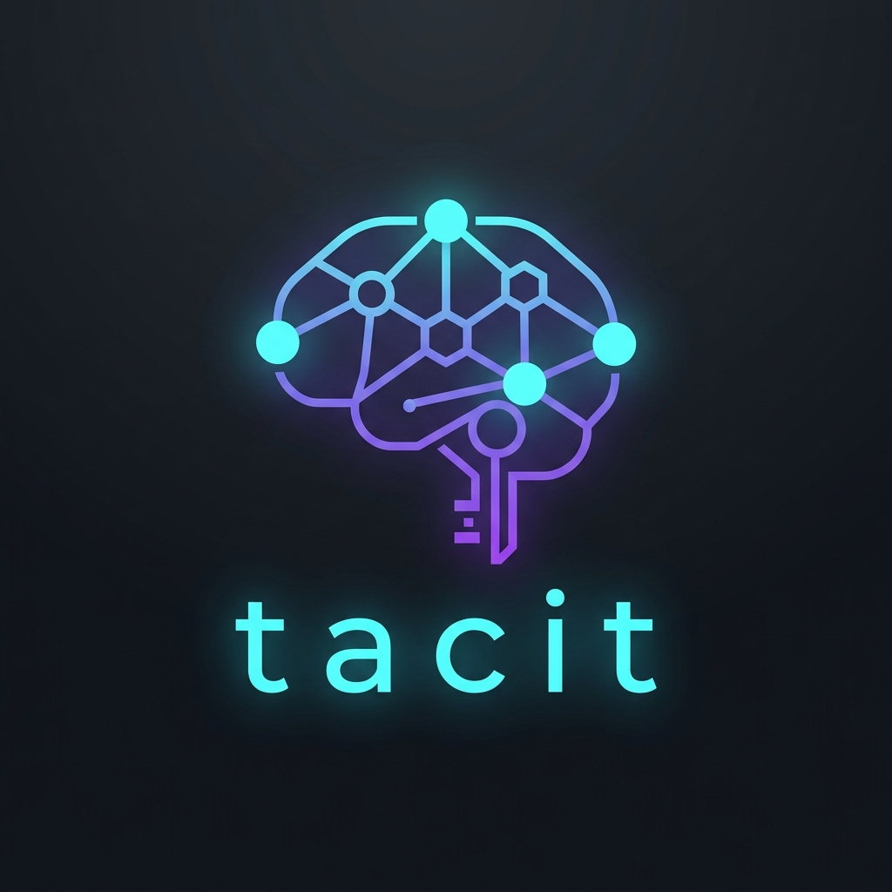

<div align="center">
  
  <h1>Tacit</h1>
  <p><strong>The Institutional Memory Layer and Decision Lineage Engine for AI Coding Agents</strong></p>
  <p>
    <a href="#the-problem-loss-of-context-across-new-chats">The Problem</a> •
    <a href="#how-tacit-works">How Tacit Works</a> •
    <a href="#1-quick-start-and-installation">Quick Start</a> •
    <a href="#2-ai-agent-integration-mcp-setup">MCP Setup</a> •
    <a href="#3-agent-rules-automated">Master Rules</a> •
    <a href="#4-cli-usage-and-commands">CLI Commands</a> •
    <a href="#6-mcp-tools-reference">MCP Tools</a> •
    <a href="#license">License</a>
  </p>
</div>

---

## The Problem: Loss of Context Across New Chats

Every time you start a new chat in **Claude Code, Cursor, Antigravity, or OpenCode**, the AI model starts with a clean slate and no memory of previous sessions.

The model knows how to write clean code, but it lacks the unwritten context of your project:

* It does not know the undocumented workarounds ("hacks") you added to fix environment or library quirks.
* It does not know the specific operational and deployment commands needed to run your services.
* It does not know past architecture decisions or why an earlier approach was changed.

Every time you reset a chat or your conversation exceeds the context window, you have to re-type setup commands, re-explain your services, and re-warn the agent about the same constraints.

If you forget to explain a workaround, the AI model may assume the code looks redundant and refactor it away, which can re-introduce bugs you previously resolved.

---

## How Tacit Works

Tacit provides a local institutional memory layer for AI coding tools. At the start of a task, the agent receives a concise project briefing with active decisions, workarounds, and commands.

```
 ┌──────────────────────────────────────────────────────────────────┐
 │                     AI Coding Agent                              │
 │            (Claude Code / Cursor / Antigravity)                  │
 └───────────────────────────────┬──────────────────────────────────┘
                                 │
                   Model Context Protocol (MCP)
                                 │
 ┌───────────────────────────────┴──────────────────────────────────┐
 │                     Tacit Local Engine                           │
 │   Tools: memory_add, memory_search, memory_get, memory_context   │
 └───────────────────────────────┬──────────────────────────────────┘
                                 │
        ┌────────────────────────┼────────────────────────┐
        ▼                        ▼                        ▼
 ┌───────────────┐        ┌───────────────┐        ┌───────────────┐
 │ Hybrid Search │        │  Causal DAG   │        │ Markdown &    │
 │ (BM25 + ONNX) │        │ Lineage Engine│        │ Preview Server│
 └───────┬───────┘        └───────┬───────┘        └───────┬───────┘
         │                        │                        │
         ▼                        ▼                        ▼
 ┌──────────────────────────────────────────────────────────────────┐
 │              Local Project Directory (.tacit/)                   │
 │              - memory.db (SQLite with Relational Edges)          │
 │              - Merkle Hash Tree & Causal Ancestry DAG            │
 └──────────────────────────────────────────────────────────────────┘
```

---

### Core Mechanics

#### 1. Instant Session Bootstrapping (`memory_context()`)
At the start of every session, your AI agent calls `memory_context()` to load an intelligent, token-budgeted project briefing. Instead of naive date filters, Tacit ranks decisions using a multi-signal scoring curve:
$$\text{Score}(d) = 0.35 \cdot \text{Impact}(d) + 0.40 \cdot \text{Centrality}(d) + 0.25 \cdot \text{Recency}(d) - \text{Penalty}(d)$$
* **DAG Centrality**: Foundational decisions that later choices depend on are amplified ($f_{\text{centrality}} = \frac{n}{n + 8}$).
* **Recency Decay**: A 6-month half-life curve keeps advice fresh without dropping core principles ($f_{\text{recency}} = 0.5^{(\text{days} / 180)}$).
* **Token Budgeting**: Assembles the top context into **Tier 1 (deep reading with lineage)** and **Tier 2 (one-liner summaries by tag)** within your configured token budget (`TACIT_TOKEN_BUDGET`).

#### 2. Causal DAG and The "REPLACED" Sticker System
Engineering history is immutable; you should never erase past lessons. When an architectural choice changes, Tacit attaches a typed **`supersedes`** edge to the old entry pointing to the new one, explaining *why* it was replaced. 
* Dead advice is filtered out of active briefings so stale rules never poison fresh prompts.
* If an agent inspects an old decision, Tacit shows a warning banner: `⚠️ SUPERSEDED by <successor_id>: "<reason>"`.
* The complete causal ancestry (`derives_from` and `supersedes`) remains inspectable.

#### 3. Autonomous End-of-Task Reflection
Tacit turns your AI coding tool into an active collaborator in memory hygiene. At the end of every non-trivial coding task, the agent automatically checks:
> *"Did I make a non-obvious design choice, apply an undocumented workaround, solve a tricky error, or execute a deployment command?"*
If **yes**, it records distilled tacit knowledge into `.tacit/` (linking parents and superseded IDs). If **no**, it leaves the database clean.

#### 4. Local Hybrid Search (FastEmbed ONNX + BM25)
Zero cloud API keys, zero PyTorch dependencies (~50MB ONNX runtime). Combines exact lexical matching (SQLite FTS5 / BM25) with dense semantic embeddings (`BAAI/bge-small-en-v1.5`) using **Reciprocal Rank Fusion (RRF)**:
$$\text{RRF}(d) = \sum_{r \in \text{channels}} \frac{1}{60 + \text{rank}_r(d)}$$
Queries execute in under 5 milliseconds on your local CPU with automatic scope and recency boosting.

#### 5. Cryptographic Proofs and Dual-Write Storage
* Every memory is addressed by its **SHA-256 content hash** and linked via a **Merkle root**. `tacit verify` verifies history has not been altered.
* **Dual-Write**: Saves to `memory.db` for fast agent queries and maintains human-readable `.md` files in `.tacit/<category>/`.

---

## Table of Contents
1. [Quick Start and Installation](#1-quick-start-and-installation)
2. [AI Agent Integration (MCP Setup)](#2-ai-agent-integration-mcp-setup)
3. [Agent Rules (Automated)](#3-agent-rules-automated)
4. [CLI Usage and Commands](#4-cli-usage-and-commands)
5. [Live Markdown Preview Server and Dashboard](#5-live-markdown-preview-server-and-dashboard)
6. [MCP Tools Reference](#6-mcp-tools-reference)
7. [Multi-Project Support](#7-multi-project-support)
8. [Testing](#8-testing)
9. [License](#license)

---

## 1. Quick Start and Installation

To get Tacit running in your environment, execute the following commands in sequence:

### Step 1: Install Tacit from source
```bash
# Clone the repository
git clone https://github.com/AlexLeoTz/tacit.git
cd tacit

# Install globally on your machine (editable mode for active development)
pip install -e .
```

> [!IMPORTANT]
> **Windows Installation and Update Note**: Before running `pip install -e .` or `tacit update` on Windows, make sure all running Tacit instances (such as Cursor, Claude Desktop, or `tacit serve`) are stopped. Windows locks active `.exe` binaries, which will cause the installer to stop with a `PermissionError`.

---

### Step 2: Register MCP server globally
This registration command modifies your editor configuration globally. It can be run from any folder:
```bash
# For Antigravity CLI
tacit install-mcp --client antigravity

# For Claude Desktop
tacit install-mcp --client claude

# For Claude Code (Terminal CLI)
tacit install-mcp --client claude-code

# For Cursor
tacit install-mcp --client cursor
```

---

### Step 3: Initialize the project memory directory
Navigate to your specific project workspace directory (e.g. `cd /path/to/my-project`) and initialize the database. Run this command inside your project root directory:
```bash
tacit init
```

---

### Step 4: Run the live markdown preview server
Start the web dashboard to search, view, and insert project memories directly. Run this command inside your project root directory:
```bash
tacit serve
```

---

## 2. AI Agent Integration (MCP Setup)

Tacit runs as a local MCP server that automatically detects whichever project directory your coding tool has open.

---

### Manual MCP Configuration and Client Setup

Tacit runs locally as an **STDIO MCP server**: a local background process communicated with via standard input/output streams by your AI coding client.

> [!NOTE]
> **Harness Compatibility**: Tacit is tested and verified to work natively in **Antigravity CLI**, **Claude Desktop**, **Claude Code**, and **Cursor**.

#### 1. Claude Code and Claude Desktop
Add this to your `claude_desktop_config.json` (on Windows: `%APPDATA%\Claude\claude_desktop_config.json`):

```json
{
  "mcpServers": {
    "tacit": {
      "command": "tacit",
      "args": ["mcp"]
    }
  }
}
```

#### 2. Cursor
Go to **Settings** -> **Features** -> **MCP**, click **+ Add New MCP Server**, and configure:
* **Name**: `tacit`
* **Type**: `stdio`
* **Command**: `tacit mcp`

---

## 3. Agent Rules (Automated)

When you run `tacit init` in any project, it generates rule files automatically:
* **Antigravity / AGY CLI**: `.agents/rules/tacit.md`
* **Cursor**: `.cursorrules`
* **MCP Prompts**: Exposed directly over the MCP protocol as `tacit-instructions`.

---

## 4. CLI Usage and Commands

You can run `tacit` in any project directory on your machine. It automatically discovers and initializes the `.tacit/` directory for that workspace.

### Initialize a Project
```bash
# Run in the root of your project
tacit init
```

### View Relevance-Ranked Session Briefing
```bash
# Generates DAG-centrality and recency-decayed project briefing
tacit briefing

# Or customize token budget directly
tacit briefing --budget 1500
```

### Search Memories (Hybrid BM25 + ONNX Embeddings)
```bash
# Hybrid semantic search with RRF fusion (default)
tacit search "database connection exhaustion"

# Keyword-only search
tacit search "docker" --mode keyword --type command

# Search with active file scope boosting
tacit search "authentication" --scope src/api/auth.py

# Include historical or superseded memories
tacit search "JWT" --include-superseded
```

### Backfill Vector Embeddings
```bash
# Embed all memories in the database using local fastembed (idempotent and resumable)
tacit reindex
```

### Record a Memory
```bash
# Add a decision
tacit remember "Migrated authentication from sessions to JWT with 15-minute rotation" \
  --type decision \
  --tags "auth,security,jwt" \
  --impact high

# Add a decision that supersedes a previous one
tacit remember "Reverted to sessions due to JWT refresh rotation vulnerabilities" \
  --type decision \
  --tags "auth,security,session" \
  --impact high \
  --supersedes 4a9f1234 \
  --relation-note "JWT token leakage risk in distributed workers"

# Add a command
tacit remember "docker compose -f docker-compose.prod.yml up -d --build" \
  --type command \
  --tags "deploy,docker,prod"

# Add a workaround / hack with parent links
tacit remember "Temporary fix for SQLite thread lock: set WAL mode and 5s timeout" \
  --type hack \
  --tags "sqlite,db,bugfix" \
  --parents 54bd72c1
```

### Verify Cryptographic Integrity
```bash
# Recomputes and checks SHA-256 hashes and Merkle lineage across all nodes
tacit verify
```

### Lifecycle Management (Supersede and Retract)
```bash
# Mark a memory node as superseded by a successor
tacit supersede <old_node_id> --by <new_node_id> --reason "Revised architecture"

# Retract an erroneously recorded entry
tacit retract <node_id> --reason "Never deployed"
```

### View Recent Memories
```bash
# Show memories recorded in the last 7 days
tacit recent --days 7

# Show last 20 memories of type 'error'
tacit recent --days 30 --type error --limit 20
```

### Export Standalone Markdown Documentation
```bash
# Export all memories to categorized markdown files with an INDEX.md table of contents
tacit export

# Export to a custom backup folder
tacit export --output ./docs/project-memories
```

### Configuration Options and Environment Variables

| Variable | Default | Purpose |
|---|---|---|
| `TACIT_TOKEN_BUDGET` | `2000` | Token budget cap for `memory_context()` and `tacit briefing`. |
| `TACIT_EMBED_MODEL` | `BAAI/bge-small-en-v1.5` | FastEmbed ONNX embedding model. |
| `TACIT_DUAL_WRITE` | `true` | Auto-sync `.md` files into `.tacit/<category>/`. Set `false` for SQLite-only. |
| `PREVIEW_PORT` | `4000` | HTTP port for the web dashboard. |
| `PREVIEW_WS_PORT` | `4001` | WebSocket port for live updates. |

### Visualizing Causal DAGs and Lineage

```bash
# Renders the entire project decision DAG as a nested tree
tacit tree

# Traces causal foundations (ancestors) and derived decisions (descendants) for a specific node
tacit lineage 4a9f
```

---

## 5. Live Markdown Preview Server and Dashboard

Tacit includes a local web dashboard with live WebSocket reload, theme options, search, category filtering, and markdown rendering.

```bash
# 1. Start live preview server (defaults to HTTP: 4000, WebSocket: 4001 or next available)
tacit serve

# 2. Specify custom ports for both HTTP and WebSocket
tacit serve --port 3000 --ws-port 3001
```

---

## 6. MCP Tools Reference

When connected via MCP, AI agents have access to the following 6 tools:

| Tool | Purpose | Key Arguments |
|---|---|---|
| `memory_add` | Persist an immutable decision, command, hack, architecture, or error. Supports superseding past decisions. | `content`, `type`, `summary`, `tags`, `impact`, `parents`, `supersedes`, `relation_note` |
| `memory_search` | Hybrid search (BM25 + fastembed ONNX dense vectors via RRF). | `query`, `type`, `tags`, `limit`, `mode`, `scope_hint`, `include_superseded`, `debug` |
| `memory_get` | Fetch markdown content and Merkle lineage by ID. Shows alert banners if superseded or retracted. | `node_id` |
| `memory_recent` | List chronological memories from the last N days. | `days`, `limit`, `type` |
| `memory_context` | Generate a relevance-ranked, token-budgeted project briefing (DAG centrality, impact, recency decay). | `budget`, `scope_hint`, `timeframe` |
| `memory_projects`| List all registered project workspaces across your machine. | None |

> Deletion is restricted to developers via the CLI (`tacit delete <id>`) or Dashboard UI to prevent AI agents from removing historical institutional memory.

---

## 7. Multi-Project Support

Tacit keeps each codebase memories isolated:
- Every project stores its database at `<project-root>/.tacit/memory.db`.
- Auto-detects the project root from `.git`, `package.json`, `pyproject.toml`, or `.tacit`.
- Track all projects on your machine with:
  ```bash
  tacit projects
  ```

---

## 8. Testing

Run the test suite using `pytest`:

```bash
pytest tests/ -v
```

---

## License

This project is licensed under the **Functional Source License, Version 1.1, MIT Conversion** ([`FSL-1.1-MIT`](./LICENSE)).

### Plain English Summary:
* **Free for Developers and Organizations**: You are free to use Tacit, modify it, integrate it into your internal workflows, deploy it in products, and redistribute it without fees.
* **The Only Restriction**: For a period of **two years** from each release date, third parties cannot take Tacit and offer it as a competing commercial cloud service or managed SaaS platform.
* **Automatic Conversion to MIT**: Exactly two years after each release, the license for that version automatically and permanently converts to the standard **MIT License**.

See the [`LICENSE`](./LICENSE) file for complete legal terms.
