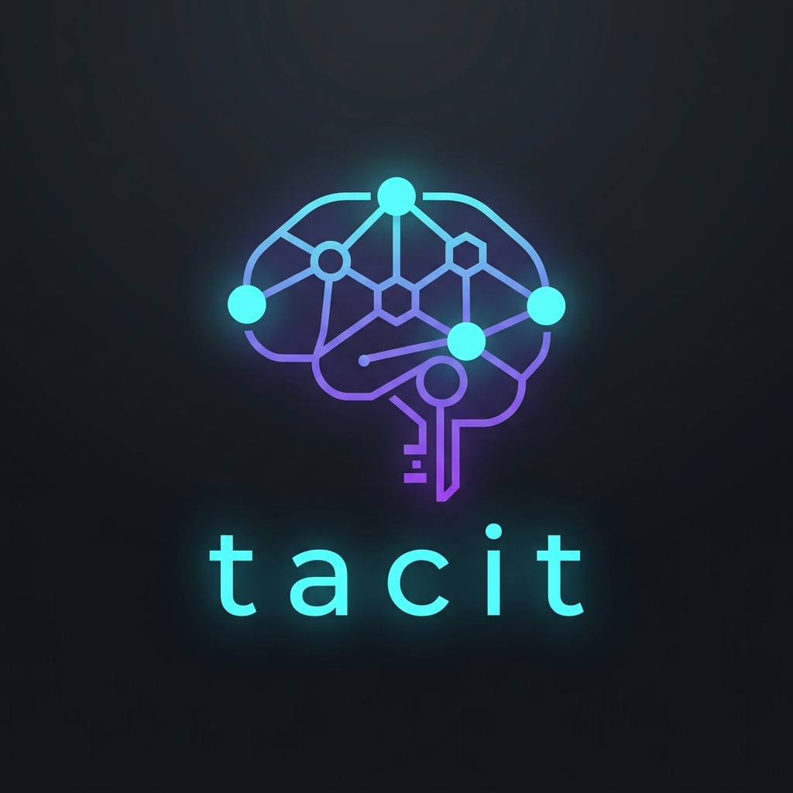

<div align="center">
  
  <h1>Tacit</h1>
  <p><strong>Institutional memory and decision lineage for AI coding agents</strong></p>
  <p>
    <a href="#quick-start">Quick Start</a> •
    <a href="#what-your-agent-gets">What your agent gets</a> •
    <a href="#commands">Commands</a> •
    <a href="#reference">Reference</a> •
    <a href="#license">License</a>
  </p>
</div>

---

Every new chat starts from zero. The model can write code, but it does not know the workaround you added for a library quirk, the deploy command that actually works, or why last month's approach was abandoned. So you re-explain it — and if you forget, the agent "cleans up" your workaround and the bug comes back.

**Tacit is a local memory layer that fixes this.** It stores distilled engineering knowledge — decisions, hacks, constraints, commands, resolved errors — in your repo, and hands it back to the agent at the start of every session. No cloud, no accounts: one SQLite file inside your project.

```bash
pip install -e .                 # from a clone
tacit install-mcp --client claude-code   # or cursor / antigravity / deepseek-harness
cd /path/to/your/project && tacit init
```

That's it. From then on your agent briefs itself before it starts work, and records what it learned when it finishes.

---

## What your agent gets

**A briefing, not a dump.** `memory_context()` returns a token-budgeted set of memories ranked by *PageRank authority* over the decision graph — how many later decisions trace back to it. Foundational choices outrank fresh notes, and the graph is computed over the whole project, so a recent window never flattens the ranking.

**History on demand.** `memory_chronicle` returns *every* memory oldest-first — including the decisions that were later replaced — for questions like "why is it built this way?" or "have we tried this before?".

**A map of the codebase.** `project_structure` returns the captured layout — directories, file names, line counts, and a one-line description of what each file contains — so a new session knows where things are without opening twenty files.

**Scope that actually filters.** Tell it you are working in `backend/app` and you get `backend/app` memories. Not "mostly", not "boosted": other subsystems are excluded, and project-wide knowledge is always included. Memories from another repository cannot appear at all.

**Search that respects the graph.** Hybrid BM25 + embeddings fused by RRF, then weighted by authority. Titles, tags and summaries are embedded — never full content — which is why the agent rules insist on specific titles.

---

## Quick Start

**1. Install**

```bash
git clone https://github.com/AlexLeoTz/tacit.git
cd tacit
pip install -e .
```

> Updating later: `tacit update` detects an editable checkout and updates it in place (`git pull` + `pip install -e .`). Confirm with `tacit --version`, which prints the version *and* the directory the running code came from.

**2. Register the MCP server with your editor**

```bash
tacit install-mcp --client antigravity   # or: claude-code | claude | cursor | deepseek-harness
```

<details>
<summary>Manual configuration</summary>

Add to your client's MCP config (`claude_desktop_config.json` on Windows lives at `%APPDATA%\Claude\`):

```json
{
  "mcpServers": {
    "tacit": {
      "command": "tacit",
      "args": ["mcp"]
    }
  }
}
```

For Cursor: **Settings → Features → MCP → + Add New MCP Server**, type `stdio`, command `tacit mcp`.
</details>

**3. Initialize your project**

```bash
cd /path/to/my-project
tacit init
```

This creates `.tacit/` (database + config), writes agent rules into `.agents/rules/tacit.md` and `.cursorrules`, and asks whether to keep a project-structure snapshot.

**4. Optional: the dashboard**

```bash
tacit serve      # http://localhost:4000 — search, browse and write memories
```

---

## Commands

The handful you will actually type:

| Command | What it does |
|---|---|
| `tacit briefing` | Ranked, budgeted session briefing (`--scope backend/app` to narrow it) |
| `tacit chronicle` | Every memory oldest-first — `--brief` for a one-line timeline |
| `tacit remember "..."` | Record a decision, hack, command or error |
| `tacit search "query"` | Hybrid BM25 + semantic search |
| `tacit grep pgvector` | Literal match over titles and summaries (no model needed) |
| `tacit get <uuid>` | Print one memory verbatim (`--raw` for plain Markdown) |
| `tacit structure` | The captured codebase map (`--refresh` to re-walk it) |
| `tacit files` | The per-file table: `--pending`, `--set`, `--refresh`, `--stats` |
| `tacit serve` | Local dashboard and Markdown preview |
| `tacit update` | Update Tacit itself |
| `tacit --help` | Everything else: `tree`, `lineage`, `export`, `verify`, `move`, `projects`, `supersede`, `retract`, `reindex`, `delete`, `clear`, `mcp` |

---

## For agents

`tacit init` writes rules your agent reads automatically, so the loop works without you prompting it:

1. **Start**: brief on the project, then read the structure map, then fill any missing file-table rows.
2. **Before deciding**: check whether the decision is already made, constrained, or was already tried and rejected.
3. **Finish**: record what changed and how it was verified, link it to the decisions it derives from, and refresh the file rows touched.

Tacit stores distilled knowledge only — never chat logs, terminal output or source files.

---

# Reference

The deep end. Skip it unless you are changing Tacit or debugging it.

## MCP tools

| Tool | Purpose | Key arguments |
|---|---|---|
| `memory_add` | Record one immutable memory. `scope` is mandatory in practice — it is the filter every later read applies. | `content`, `type`, `title`, `summary`, `tags`, `scope`, `impact`, `parents`, `supersedes`, `project` |
| `memory_add_batch` | Record several related memories atomically (`$prev` links them). | `entries`, `project` |
| `memory_search` | Hybrid search, scope-filtered, ranked relevance × authority. | `query`, `type`, `tags`, `limit`, `mode`, `scope_hint`, `project` |
| `memory_context` | The briefing. | `budget`, `timeframe`, `scope_hint`, `project` |
| `memory_chronicle` | Full history, oldest first, superseded included. | `brief`, `limit` (0 = all), `type`, `timeframe`, `scope_hint`, `project` |
| `memory_get` | One memory by exact UUID, with lineage banners. | `node_id`, `project` |
| `memory_grep` | Literal substring match over titles and summaries. | `keyword`, `type`, `limit`, `scope_hint`, `project` |
| `memory_recent` | Chronological recent memories. | `days`, `limit`, `scope_hint`, `project` |
| `memory_link` | Attach an edge (`derives_from`, `supersedes`, `related`). | `child_id`, `parent_id`, `relation`, `reason` |
| `memory_pin` | Pin memories so they always appear in the briefing. | `ids`, `unpin`, `project` |
| `project_structure` | The workspace map: names, nesting, line counts, descriptions. | `refresh`, `path`, `include_gists`, `max_lines`, `project` |
| `project_files_pending` | Files whose table row is missing or stale, with facts precomputed. | `limit`, `project` |
| `project_files_update` | Write many file rows in one call (records author + timestamp). | `entries`, `by`, `project` |
| `project_gist` | Describe a single file. | `path`, `gist`, `author`, `project` |
| `memory_projects` | Every workspace registered on this machine. | — |

Plus one prompt, `tacit-instructions`, carrying the same rules the CLI writes into your repo.

### Scope is a filter, and `project` selects the workspace

* **`scope_hint` filters.** Only memories recorded against those paths — plus project-wide memories — are returned. Omitting it reads the whole workspace. An empty answer names the scope that emptied it, so a wrong scope is never mistaken for missing knowledge.
* **`project` names the workspace.** One Tacit MCP server can serve several workspaces; pass your workspace root on every call. Without it, the call falls back to the directory the server was launched in.
* **Tacit never invents a store.** If the launch directory is a container (home, drive root, system or temp folder) or has no project marker (`.tacit`, `.git`, `pyproject.toml`, `package.json`), `tacit mcp` refuses to create a store there and reports it rather than letting one store answer for every workspace underneath.

## How ranking works

Briefing score, per memory:

$$\text{Score} = \text{Authority} \times (0.6 + 0.4 \cdot \text{Impact}) \times (0.7 + 0.3 \cdot \text{Recency}) \times (1 + \text{type prior}) - \text{penalty}$$

* **Authority** is PageRank over `child → derives_from → parent` links. A memory many later memories build on outranks a fresh one nobody referenced.
* **Impact and recency are bounded tie-breakers**: together they can reorder comparable memories, never overturn a decisive authority gap.
* **Penalty** pushes down a memory adjacent to a recently corrected one, fading over ~2 months.
* **Search** is `RRF × recency × (0.5 + 0.5 · authority)`; relevance and authority multiply, so neither can rescue the other.

Token budget comes from `TACIT_TOKEN_BUDGET` (default 2000): the top slice is rendered in full with lineage, the remainder as one-liners grouped by tag.

## Memory model

* **Immutable nodes.** A change of mind is a *new* node with a `supersedes` edge, never an edit. Superseded guidance is filtered out of briefings but stays inspectable, with a warning banner when read directly.
* **Closed taxonomy.** `decision`, `command`, `hack`, `architecture`, `error`, `context`, `constraint`, `convention`, `security`, `performance`, `integration`, `migration`.
* **Integrity.** Every node carries a SHA-256 `content_hash` and a Merkle root over its ancestry; `tacit verify` recomputes both.
* **Dual-write.** Memories live in `memory.db` *and* as human-readable Markdown under `.tacit/<category>/` (`TACIT_DUAL_WRITE=false` for SQLite only).
* **Auto-linking.** A candidate parent at affinity ≥ 0.50 is attached silently; 0.15–0.50 emits a `[TACIT GRAPH NOTICE]` listing candidates for the agent to link.

## Multi-project and the file table

* Every project keeps its own database at `<project-root>/.tacit/memory.db`; the root is discovered from `.tacit`, `.git`, `pyproject.toml` or `package.json`.
* A workspace root may hold several repositories (`backend/` + `frontend/`): they are discovered by looking for `.git`, or pinned with `tacit structure --set-repos backend,frontend`.
* Container directories — and directories with no project marker at all — are never treated as a project root, so unrelated workspaces cannot end up sharing one store. `tacit init` is the one command that may create a project in a plain directory.
* `tacit projects` lists every workspace registered on the machine.
* `tacit move <subfolder>` relocates a store (database, exports and model cache together) and leaves a pointer at `<root>/.tacit/location`, so nothing else changes.

**The file table.** `tacit init` can keep a structure snapshot of the workspace: directory and file **names only, never source code**, plus one row of metadata per file — lines of code, size, language, content hash, a compact description, and who last updated it and when. Agents read it with `project_structure`, fill missing rows with `project_files_pending` + `project_files_update`, and refresh rows after editing a file; a row whose hash no longer matches the file is reported as stale. Dependency trees, build output and caches are skipped; dotfiles such as `.env` are kept, because they are part of the layout.

## Environment variables

| Variable | Default | Purpose |
|---|---|---|
| `OPENAI_API_KEY` | — | `text-embedding-3-small` (1536-dim). Highest-priority embeddings. |
| `GEMINI_API_KEY` | — | `gemini-embedding-001` (768-dim). Used when no OpenAI key is set. |
| `TACIT_OPENAI_EMBED_MODEL` | `text-embedding-3-small` | OpenAI model override. |
| `TACIT_EMBED_MODEL` | `BAAI/bge-small-en-v1.5` | Local ONNX model (only when no API key is set). |
| `TACIT_EMBED_CACHE` | per-user cache | Where the ONNX model is stored; falls back to `<project>/.tacit/models` when the default is not writable. |
| `TACIT_TOKEN_BUDGET` | `2000` | Briefing token budget. |
| `TACIT_PROJECT` | CWD | Pin the workspace, overriding directory discovery. |
| `TACIT_HOME` | `~/.gemini/config` | Where the cross-project registry and update cache/log live. Set it to keep that state elsewhere (portable installs, tests, containers). |
| `TACIT_DUAL_WRITE` | `true` | Write Markdown beside the database. |
| `TACIT_NO_PATH_VALIDATION` | — | Set `true` to skip validating that `scope` paths exist. |
| `PREVIEW_PORT` / `PREVIEW_WS_PORT` | `4000` / `4001` | Dashboard ports. |

## Updating Tacit

If Tacit was installed editable, `tacit update` runs `git pull` + `pip install -e .` in place instead of installing from the Git URL. `tacit --version` prints the version and the directory the code came from — if that path is not the checkout you are editing, reinstall from the right one.

**Windows.** A running `tacit.exe` (including the MCP server your editor started) cannot be replaced in place — hence `[WinError 32] ... tacit.exe -> tacit.exe.deleteme`. `tacit update` handles this: it runs detached, waits for the current process to exit, stops leftover `tacit serve`/`tacit mcp` daemons and their backing `python.exe`, quarantines the old launcher, clears stale `~acit-…dist-info` leftovers, then reinstalls. Because the detached updater has no console, its output goes to `~/.gemini/config/tacit_update.log` and `tacit_update_status.json`; the *next* `tacit` command reports how the run ended. If it keeps failing, quit the editors that have the Tacit MCP server configured and re-run it.

## Testing

```bash
pytest tests/ -v
```

The suite is self-contained: every fixture builds a mock project under `tests/_*/`, and `tests/conftest.py` redirects Tacit's per-machine state (`TACIT_HOME`) into the workspace, so a run never touches your real registry or projects.

---

## License

This project is licensed under the **Functional Source License, Version 1.1, MIT Conversion** ([`FSL-1.1-MIT`](./LICENSE)).

* **Free for developers and organizations**: use it, modify it, integrate it, deploy it, redistribute it.
* **The only restriction**: for two years from each release, third parties cannot offer it as a competing commercial cloud service or managed SaaS platform.
* **Automatic conversion to MIT**: exactly two years after each release, that version's license permanently becomes standard **MIT**.

See [`LICENSE`](./LICENSE) for the complete terms.
